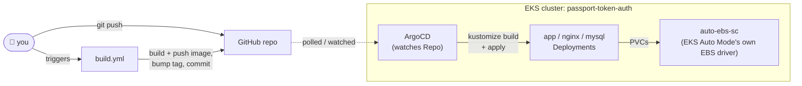

<div align="center">
    <h1>☸️ Deploying to EKS via ArgoCD</h1>
    <p>GitOps: push to git, ArgoCD notices, ArgoCD deploys. No manual kubectl apply of app manifests, ever.</p>
</div>

-----

## 📖 Table of Contents

- [Architecture](#-architecture)
- [Cluster facts](#-cluster-facts)
- [Prerequisites](#-prerequisites)
- [Walkthrough (from scratch)](#-walkthrough-from-scratch)
- [Day-to-Day Commands](#-day-to-day-commands)
- [Gotchas We Actually Hit](GOTCHAS.md)
- [Public Access (in progress)](#-public-access-in-progress)

-----

## 🗺️ Architecture



The one thing that makes this GitOps rather than "run kubectl a lot": **ArgoCD is the only
thing that ever applies app manifests to the cluster.** You edit files and push; ArgoCD
does the rest. The only `kubectl apply` you run by hand is registering the `Application`
itself (once, or when adding a new environment) and one-time cluster bootstrap.

-----

## 📌 Cluster facts

- **Cluster name**: `passport-token-auth`
- **Region**: `ap-south-1`
- **Context**: `arn:aws:eks:<region>:<account-id>:cluster/passport-token-auth` (run
  `aws eks update-kubeconfig` to generate the real value for your own account)
- **Compute**: EKS Auto Mode (no manually-managed node group — AWS provisions nodes automatically)
- **Namespace per environment**: `passport-token-auth-<env>` (e.g. `passport-token-auth-dev`)

-----

## ⚙️ Prerequisites

| Tool | Used for |
|---|---|
| AWS CLI, configured (`aws configure`) | Talking to your AWS account |
| kubectl | Talking to the cluster |
| An EKS cluster already created | This doc doesn't cover cluster creation — see AWS Console → EKS → Create cluster (Auto Mode) |

-----

## 🧭 Walkthrough (from scratch)

### 1. Point kubectl at the cluster
```bash
aws eks update-kubeconfig --name passport-token-auth --region ap-south-1
```
This writes cluster connection info into `~/.kube/config` and switches your current
context to it. Check with `kubectl config current-context` — and since you likely also
have local `kind` contexts registered, consider passing `--context arn:aws:eks:...`
explicitly on every command below to avoid ever hitting the wrong cluster by accident.

### 2. Install the Gateway API CRDs
Required — the app's manifests define `Gateway`/`HTTPRoute` resources, which aren't
built into Kubernetes by default.
```bash
kubectl apply -f https://github.com/kubernetes-sigs/gateway-api/releases/download/v1.1.0/standard-install.yaml
```

### 3. Install ArgoCD
```bash
kubectl create namespace argocd
kubectl apply -n argocd -f https://raw.githubusercontent.com/argoproj/argo-cd/stable/manifests/install.yaml
```

### 4. Get into the ArgoCD UI
```bash
kubectl port-forward svc/argocd-server -n argocd 8080:443
```
Leave that running in its own terminal (it's a live tunnel, not a one-shot command). In a
**second** terminal, get the admin password — PowerShell can't pipe to `base64 -d`, so:
```powershell
[System.Text.Encoding]::UTF8.GetString([System.Convert]::FromBase64String((kubectl -n argocd get secret argocd-initial-admin-secret -o jsonpath='{.data.password}')))
```
→ `https://localhost:8080` (accept the self-signed cert warning), user `admin`, that password.

### 5. Build a real image before registering the app
Run `build.yml` once (branch `main`, environment `dev`) so `k8s/overlays/dev/kustomization.yaml`
has a real, pushed image tag committed — otherwise ArgoCD's first sync pulls a
non-existent image and every pod sits in `ImagePullBackOff`.

### 6. Register the app with ArgoCD — the actual "connect repo to cluster" step
```bash
kubectl apply -f k8s/argocd/application-dev.yaml
```
This creates one `Application` object — ArgoCD notices it, clones the repo, renders
`k8s/overlays/dev` with kustomize, and (since `syncPolicy.automated` is set) deploys it
immediately. Nothing before this step touches your actual app; everything after it is
ArgoCD reacting automatically, not manual `kubectl apply`.

-----

## 🔁 Day-to-Day Commands

<details>
<summary><strong>🔍 Check status</strong></summary>

```bash
kubectl get application -n argocd
kubectl get pods,pvc -n passport-token-auth-dev
kubectl describe pod <pod-name> -n passport-token-auth-dev
```
</details>

<details>
<summary><strong>📜 Logs</strong></summary>

```bash
kubectl logs -n passport-token-auth-dev deploy/app -c app
kubectl logs -n passport-token-auth-dev deploy/app -c run-migrations --previous
```
`--previous` gets a crashed container's last attempt — if that comes back "unable to
retrieve container logs" (log already rotated away), drop `--previous` to see the
current attempt instead.
</details>

<details>
<summary><strong>🌐 Access the app locally</strong></summary>

```bash
kubectl port-forward svc/nginx 8000:8000 -n passport-token-auth-dev
```
→ `http://localhost:8000` and `http://localhost:8000/healthz`. See
[Public Access](#-public-access-in-progress) for a real AWS URL instead.
</details>

<details>
<summary><strong>♻️ Force a sync / recover from a stuck state</strong></summary>

Click **Sync** in the ArgoCD UI, or delete a stuck resource and let `selfHeal` recreate
it (safe for anything not holding real data, e.g. a `Pending` PVC that never bound):
```bash
kubectl delete pvc <name> -n passport-token-auth-dev
kubectl delete pod -n passport-token-auth-dev -l app=app
```
</details>

-----

## 🐛 Gotchas We Actually Hit

Moved to [GOTCHAS.md](GOTCHAS.md) — every real bug hit setting this up (branch drift, the
EKS Auto Mode storage-driver mismatch, PVC immutability, the kustomize version gap, the
`fsGroup` fix, and the Dockerfile ownership bug), so this walkthrough stays short.

-----

## 🌐 Public Access (in progress)

No `GatewayClass` exists on this cluster by default (unlike storage, Auto Mode doesn't
ship a Gateway API implementation out of the box). To get a real public ALB URL instead
of `kubectl port-forward`:

1. Check EKS Console → your cluster → **Add-ons** for **"AWS Load Balancer Controller"**
   and install it (let it auto-create the IAM role).
2. Create a `GatewayClass`:
   ```yaml
   apiVersion: gateway.networking.k8s.io/v1
   kind: GatewayClass
   metadata:
     name: alb
   spec:
     controllerName: gateway.k8s.aws/alb
   ```
3. Update [`k8s/base/gateway.yaml`](../base/gateway.yaml)'s `gatewayClassName` from the
   placeholder to `alb`, and give [`k8s/base/nginx-httproute.yaml`](../base/nginx-httproute.yaml)
   a real hostname (or drop the hostname restriction to use the ALB's generated DNS name).
4. Once `kubectl get gateway -n passport-token-auth-dev` shows `PROGRAMMED: True`, its
   `ADDRESS` column is the public URL.
