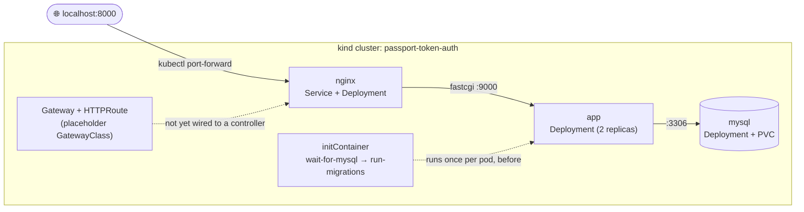

<div align="center">
    <h1>☸️ Local Kubernetes Testing with kind</h1>
    <p>Spin up this app on a real Kubernetes API — on your laptop, in Docker, in about 2 minutes.</p>
</div>

-----

## 📖 Table of Contents

- [Architecture](#-architecture)
- [Prerequisites](#-prerequisites)
- [Quick Reference](#-quick-reference)
- [Walkthrough](#-walkthrough-from-scratch)
- [Day-to-Day Commands](#-day-to-day-commands)
- [k9s — a nicer way to look at all this](#-k9s--a-nicer-way-to-look-at-all-this)
- [Known Gaps](#-known-gaps)

-----

## 🗺️ Architecture



Everything here is defined in [`k8s/base`](../../base) and patched for local use in this
`k8s/overlays/kind` folder. No image tag override — it builds and loads
`passport_token_auth-app:latest` / `passport_token_auth-nginx:latest` straight from your
local `docker-compose.kind.yml`.

-----

## ⚙️ Prerequisites

| Tool | Check | Used for |
|---|---|---|
| Docker | `docker version` | Building images, running the kind node |
| kind | `kind version` | Kubernetes-in-Docker |
| kubectl | `kubectl version --client` | Talking to the cluster |
| k9s *(optional)* | `k9s version` | TUI instead of raw `kubectl` — see [below](#-k9s--a-nicer-way-to-look-at-all-this) |

-----

## 🚀 Quick Reference

Already set up once and just want the muscle-memory version?

```bash
docker compose -f docker-compose.kind.yml build app nginx
kind load docker-image passport_token_auth-app:latest passport_token_auth-nginx:latest --name passport-token-auth
kubectl apply -k k8s/overlays/kind
kubectl rollout restart deployment/app   # if only code/config changed, cluster already exists
kubectl port-forward svc/nginx 8000:8000
```

-----

## 🧭 Walkthrough (from scratch)

### 1. Create the cluster
```bash
kind create cluster --name passport-token-auth
```

### 2. Build the app + nginx images
`docker-compose.kind.yml` is the source of truth for build args (`user`, `uid`, `env_file`) —
build through it instead of duplicating them in a raw `docker build`.
```bash
docker compose -f docker-compose.kind.yml build app nginx
```

### 3. Load the images into the kind node
kind runs as its own Docker container and can't pull your local images by itself.
```bash
kind load docker-image passport_token_auth-app:latest passport_token_auth-nginx:latest \
  --name passport-token-auth
```

### 4. Install the Gateway API CRDs
Required once per cluster — this overlay defines `Gateway`/`HTTPRoute`, which aren't
built into vanilla Kubernetes.
```bash
kubectl apply -f https://github.com/kubernetes-sigs/gateway-api/releases/download/v1.1.0/standard-install.yaml
```

### 5. Apply the overlay
```bash
kubectl apply -k k8s/overlays/kind
```

### 6. Watch it come up
`mysql:8.0`'s image pull is the slowest part (~1–2 min); everything else is fast.
```bash
kubectl get pods -w
```

### 7. Open it
```bash
kubectl port-forward svc/nginx 8000:8000
```

> [!TIP]
> **http://localhost:8000** for the app, **http://localhost:8000/healthz** for the
> lightweight nginx health check that doesn't touch PHP-FPM or the DB.

-----

## 🔁 Day-to-Day Commands

<details>
<summary><strong>🔍 Inspect the cluster</strong></summary>

```bash
# Preview the fully-rendered manifest without applying — catch YAML/patch mistakes early
kubectl kustomize k8s/overlays/kind

# One-shot overview of everything the overlay created
kubectl get deploy,pod,svc,hpa,gateway,httproute -o wide

# Why is a pod not Running/Ready? (probe failures, image pull errors, scheduling)
kubectl describe pod <pod-name>

# Cluster-wide chronological event feed — good for "something's stuck, why?"
kubectl get events --sort-by=.lastTimestamp
```
</details>

<details>
<summary><strong>📜 Logs & shell access</strong></summary>

```bash
# Tail app logs live (add -c app or -c run-migrations to target a specific container)
kubectl logs -f deploy/app

# Shell into a running pod
kubectl exec -it deploy/app -- sh

# Query mysql directly
kubectl exec -it deploy/mysql -- mysql -uroot -proot passport_token_auth
```
</details>

<details>
<summary><strong>♻️ After changing code or config</strong></summary>

```bash
# Code change: rebuild → reload → force pods to pick up the new image
docker compose -f docker-compose.kind.yml build app
kind load docker-image passport_token_auth-app:latest --name passport-token-auth
kubectl rollout restart deployment/app

# ConfigMap/Secret change: re-apply, then bounce pods to pick it up
kubectl apply -k k8s/overlays/kind
kubectl rollout restart deployment/app
```
</details>

<details>
<summary><strong>🧹 Tearing down</strong></summary>

```bash
# Just the app (keep the cluster)
kubectl delete -k k8s/overlays/kind

# Everything
kind delete cluster --name passport-token-auth
```
</details>

-----

## 🖥️ k9s — a nicer way to look at all this

A terminal UI so you're not typing `kubectl get pods -w` in a loop.

```bash
k9s --context kind-passport-token-auth
```

Type `:` then a resource alias to jump to that view:

| Command | Use case |
|---|---|
| `:pods` | Live pod list |
| `:deploy` | Deployment/rollout status |
| `:svc` | Services |
| `:hpa` | HPA targets (see [Known Gaps](#-known-gaps)) |
| `:cm` / `:secrets` | Inspect ConfigMap/Secret content (secrets masked; `x` reveals) |
| `:gtw` / `:httproute` | Gateway/HTTPRoute status |

With a resource selected (arrows + `Enter`):

| Key | Use case |
|---|---|
| `l` | Live-tail logs |
| `d` | Describe |
| `y` | View full YAML |
| `s` | Shell into the container |
| `e` | Edit live (opens `$EDITOR`, applies on save) |
| `Shift-F` | **Interactive port-forward** — no `kubectl port-forward` command needed |
| `Ctrl-K` | Delete the resource |

Global: `/` filters the current list · `:xray deploy` shows the deployment → replicaset →
pod → container tree · `:ctx` switches cluster context · `Esc` backs out.

-----

## ⚠️ Known Gaps

> [!WARNING]
> **HPA won't actually scale.** `app`/`nginx`'s `HorizontalPodAutoscaler`s need the
> `metrics-server` add-on, which vanilla `kind` doesn't install. Only matters if you
> want to exercise autoscaling behavior locally, not for normal testing.

> [!NOTE]
> **Gateway shows `PROGRAMMED: Unknown`.** `gateway.yaml` uses a placeholder
> `gatewayClassName` since no real Gateway API controller is installed in this local
> cluster. Use `kubectl port-forward` for local access instead — see the walkthrough above.
